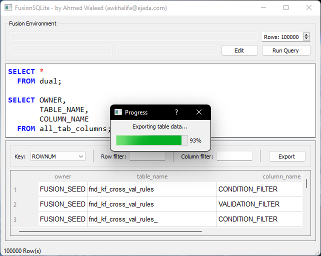

# FusionSQLite
Run SQL queries on Oracle Fusion Database from your desktop, based on [anandvegaraju/FusionSQLite](https://github.com/anandvegaraju/FusionSQLite)
> Note: [releases](https://ahmedwaleed.csed22.com/fsql) will be included in this repository, but source code will not be available. **(private fork)**

  

## Requirements 

Ensure your fusion instance account has:
- Integration Specialist
- Application Administrator/Developer

## Limitations

Since the output is generated via Oracle Report, it will face the same limitations:
- Timeout after 500 secs
- Max row count of 2 million
- Max size of 524288000 bytes (500 MB)

## Features

- Most of what you would expect from a simple SQL editor, details will be included in releases

## TODO

- PLSQL support

- Auto completion

- Execution time details

- Open and save SQL files

- Count rows after filtration

- Integration with Notepad++

- More detailed error messages

- Editor: resize font, line number, search

- Run query on different thread to control it

- Context Menu: add more functionality like COUNT and DESC

## Known Issues

- Not all reserved keywords are highlighted

- Multiline comments are not syntax highlighted

- Copying multiple values in the outputs only returns last one
