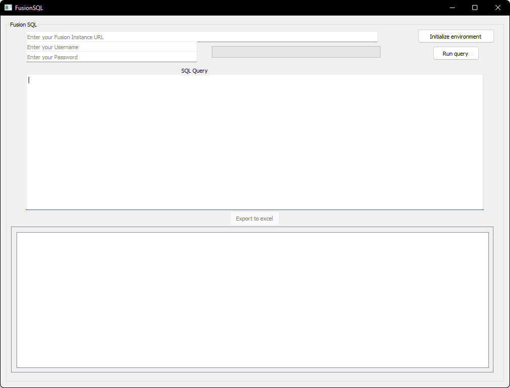

# FusionSQLite
Run SQL queries on Oracle Fusion Database from your desktop, based on [anandvegaraju/FusionSQLite](https://github.com/anandvegaraju/FusionSQLite)
> Note: updated releases will be included in this repository, but source code will not be avaialabe. **(private fork)**

## Requirments 
Ensure your fusion instance account has:
- Integration specialist roles
- Appropriate folder permissions

## Steps

1. Open the exe after bypassing the warnings

2. Enter your Fusion instance URL (Starting with https:// and ending with .com), username and password

3. Click on "Initialize environment" for the first time

4. Enter your SQL statement

5. Click on "Run Query"

Optionally, you can click on "Export to Excel" to export your result set

## Limitations

Still planning to add an option to save instance details

Current build uses a data model having a refcursor to handle SQL queries. Will change that in future releases

Try including ROWNUM explicitly in your queries. The application can handle large data sets (will show "Not responding" briefly before fetching the results) but I'm planning to optimise this soon

Feel free to use the source code and/or contribute to the GIT repository with your own optimisations, features/additions
